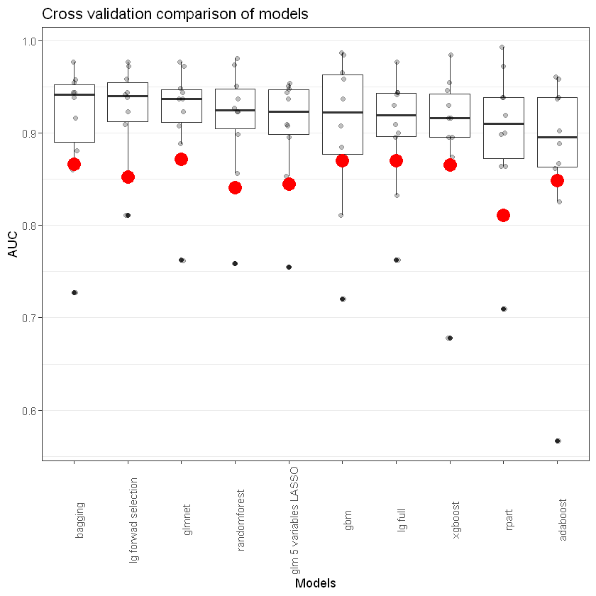

 # heartdisease_uciml

This repository presents methods for classificaiton with the heart disease data set from the uci machine learning repository [uci machine learning repository](https://archive.ics.uci.edu/ml/datasets/Heart+Disease). Main focus will be logistic regression and decision trees. 

Purpose of this repo was to learn R. That is the reason I implemented the k-fold cross validation by myself. 

None of the models is really outperforming.

The read dot indicates the AUC of the test set. 

 1. Exploratory data analysis (EDA)
 
    1.1. [Overview of the data set.](https://github.com/felix-ha/heartdisease_uciml/blob/master/Overview_of_the_dataset.ipynb)

    1.2 [EDA of categorial data.](https://github.com/felix-ha/heartdisease_uciml/blob/master/EDA_of_categorial_data.ipynb)

    1.3 [EDA of continuous data.](https://github.com/felix-ha/heartdisease_uciml/blob/master/EDA_of_continuous_data.ipynb)

    1.4 [Summary of univariate EDA.](https://github.com/felix-ha/heartdisease_uciml/blob/master/Summary_of_univariate_EDA.ipynb)

2. [Comparison of models with cross validation](https://github.com/felix-ha/heartdisease_uciml/blob/master/Comparison_of_models_with_cross_validation.ipynb)

3. Model building with logistic regression

    3.1. [Problem with rare categorial data.](http://localhost:8888/notebooks/Problem_with_rare_categorial%20data.ipynb)

    3.2 [Variable Selection](https://github.com/felix-ha/heartdisease_uciml/blob/master/Variable_Selection_Hosmer.ipynb)

    3.3 [Model Building Hosmer](https://github.com/felix-ha/heartdisease_uciml/blob/master/Model_Building_Hosmer.ipynb)

    3.4 [Data pre-Processing](https://github.com/felix-ha/heartdisease_uciml/blob/master/Data_pre_processing.ipynb)

    3.5 [Selection with Ridge](https://github.com/felix-ha/heartdisease_uciml/blob/master/Ridge.ipynb)

    3.6 [LASSO](https://github.com/felix-ha/heartdisease_uciml/blob/master/LASSO.ipynb)

    3.7 [Elastic net](https://github.com/felix-ha/heartdisease_uciml/blob/master/Elastic_net.ipynb)

    3.8 [Forward Selection](https://github.com/felix-ha/heartdisease_uciml/blob/master/Forward_Selection.ipynb)

4. Tree based Models
    
    4.1 [Decision Tree](https://github.com/felix-ha/heartdisease_uciml/blob/master/Grid_search_decision_tree.ipynb)

    4.2 [Bagging](https://github.com/felix-ha/heartdisease_uciml/blob/master/Grid_search_bagging.ipynb)

    4.3 [Random Forest](https://github.com/felix-ha/heartdisease_uciml/blob/master/Grid_search_random_forest.ipynb)

    4.4 [Gradient Boosting](https://github.com/felix-ha/heartdisease_uciml/blob/master/Gridsearch_gbm.ipynb)

    4.5 [XGBoost](https://github.com/felix-ha/heartdisease_uciml/blob/master/Grid_search_xgboost.ipynb)

5. Conclusion

[Evaluation of all models](https://github.com/felix-ha/heartdisease_uciml/blob/master/Best_models.ipynb)
